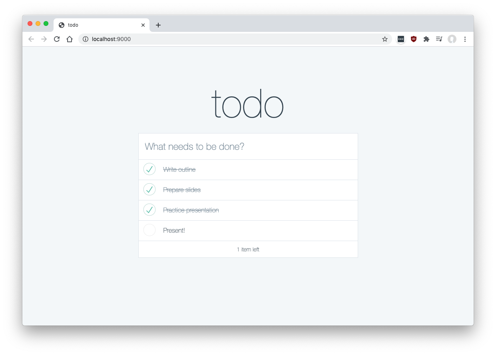

# todo

This is a small sample project used to illustrate a January 2021 lecture on frontend build systems for [web.lab](https://weblab.mit.edu/). The project is inspired by [TodoMVC](http://todomvc.com/).

Quickstart:
+ Make sure you have [yarn](https://classic.yarnpkg.com/lang/en/) installed
+ Run `yarn` to install dependencies
+ Run `yarn run build` to build the packages in this repository
+ Run `cd packages/todo-app && yarn run dev` to start webpack-dev-server
+ Open http://localhost:9000/

Layout:
+ [todo-app](./packages/todo-app) - The primary webpack bundle for the project
+ [todo-components](./packages/todo-components) - A library containing a todo list item React component
